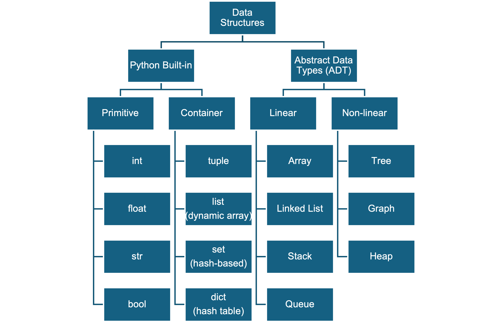
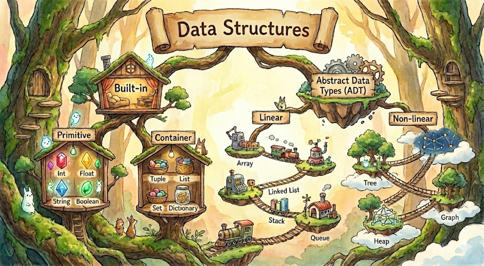
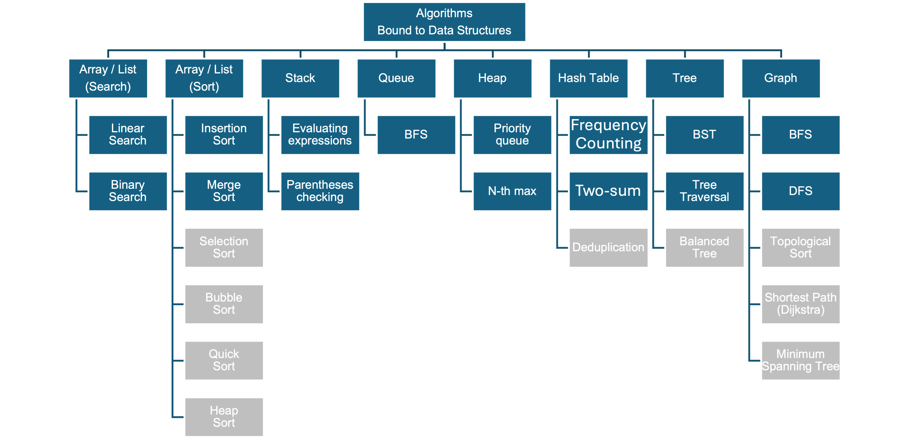
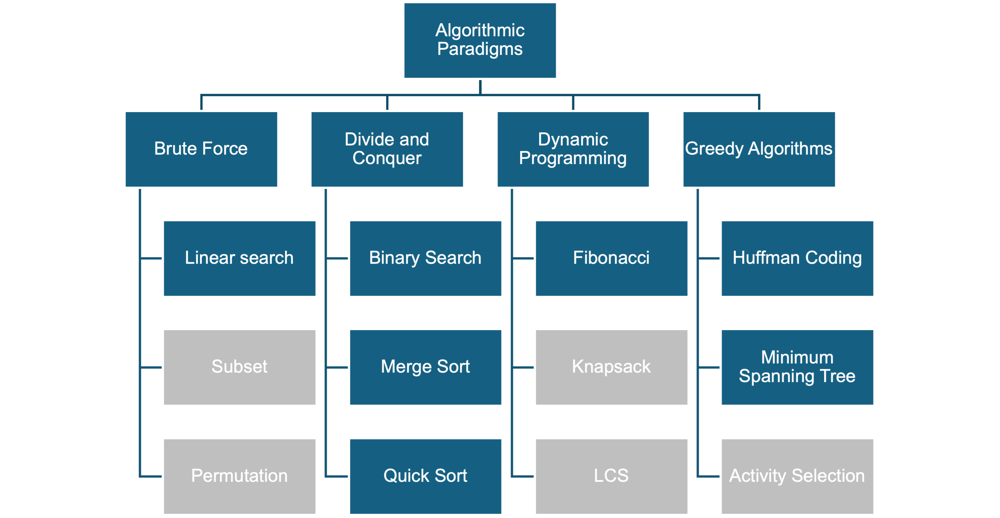

# Roadmap of Python Programmer
<div class="middle-grid">

<div>

</div>

<div>

> 核心: 輸入、處理、輸出的基本框架

> 結構: OOP讓程式有邏輯、易擴展

> 效率: DSA是程式運行的引擎

> 未來: 有了邏輯基礎，再來學習AI/ML

</div>

</div>

# Welcome to DSA
Data structures and algorithms (DSA) are the foundational tools of computer science. They allow us to write code that is not just correct, but also efficient.

* <span class="blue-text">**Data structures**</span> are specific ways of organizing and storing data so it can be accessed and modified effectively.
* <span class="blue-text">**Algorithms**</span> are the step-by-step procedures or "recipes" for performing calculations, data processing, and automated reasoning.
* Together, they help us balance the trade-offs between execution speed (<span class="blue-text">**Time Complexity**</span>) and memory usage (Space Complexity).

# Major Areas of DSA
- **The Containers (Data Structures)**
We can examine how we store data, starting with the differences between linear structures like Arrays and Linked Lists, or more complex ones like Trees and Graphs.
- **The Processes (Algorithms)**
We can look at the logic behind manipulating data, such as how we find a specific item (Searching) or arrange items in order (Sorting).
- **The Scorecard (Big O Notation)**
We can discuss how we measure the "cost" of our code to predict how its performance changes as the amount of input data grows.

# 5 Steps to Learn DSA
[](https://youtube.com/shorts/9KeE_uDsOI8?si=1pKkHL-lAU4MXcAd)

1. Learn at least one programming language
2. Learn about complexity
3. Learn data structures and algorithms
4. Practice data structures and algorithms
5. Participate in programming challenges to test your skill and efficiency

# Categorize Data Structures (1/2)

<div class="grid">

<div>



</div>

<div>

<span class="small-text">

> **Built-in / ADT**: 實作層級分類 
   - Built-in：Python 已提供的內建資料型別
   - ADT：開發者需自行實作的抽象資料型別
> **Linear / Non-linear**: 邏輯結構分類
   - Linear：資料元素間有線性關係
   - Non-linear：資料元素間無線性關係

</span>

</div>

</div>

# Categorize Data Structures (2/2)


# Why Should I Care About Data Structure
### Solve Lottery by SET or LIST, which data structure is better?
[Code of Lottery](code/lottery_comparison.py)

# Time Complexity of Set Implementation
```python
def lottery_by_set(numbers):
    buyer_nums = set(numbers)
    # 產生開獎號碼
    lottery_nums = set()
    while len(lottery_nums) < 6:
        lottery_nums.add(random.randint(1, 49))

    bingo_nums = lottery_nums & buyer_nums  # 計算中獎號碼
    return lottery_nums, bingo_nums
```
- 產生開獎號碼: O(n) 隨著號碼增加，時間線性增加
- 計算中獎號碼: O(1) 集合運算，時間不隨號碼增加而增加

# Time Complexity of List Implementation
```python
def lottery_by_list(numbers):
    buyer_nums = list(numbers)   
    lottery_nums = [] # 產生開獎號碼
    while len(lottery_nums) < 6:
        num = random.randint(1, 49)
        if num not in lottery_nums:
            lottery_nums.append(num)
    bingo_nums = []              # 計算中獎號碼
    for num1 in lottery_nums:
        for num2 in buyer_nums:
            if num1 == num2:
                bingo_nums.append(num1)
                break
    return lottery_nums, bingo_nums
```
- 產生開獎號碼: O(n) 隨著號碼增加，時間線性增加
- 計算中獎號碼: O(n**2) 隨著號碼增加，時間成兩次方增加

# Brief Data Structures Types
[Types of Data Structures（Facebook 影片）](https://www.facebook.com/share/r/1B3QMzoAYA/?mibextid=wwXIfr)

# 與資料結構最常見對應的演算法


# 演算法設計範式


# Why Should I Care About Algorithms
### Searching a number by linear search vs binary search, which algorithm is better?
[Code of Search](code/lottery.py)

# Time Complexity of Linear Search
```python
def linear_search(arr, x):
    for i in range(len(arr)):
        if arr[i] == x:
            return i
    return -1
```
搜尋的時間複雜度: O(n) 隨著資料量增加，時間線性增加

# Time Complexity of Binary Search
```python
def binary_search(arr, x):
    low = 0
    high = len(arr) - 1
    while low <= high:
        mid = (low + high) // 2
        if arr[mid] < x:
            low = mid + 1
        elif arr[mid] > x:
            high = mid - 1
        else:
            return mid
    return -1

```
搜尋的時間複雜度: O(log n) 隨著資料量增加，時間對數增加


# A Mental Model for Applying Data Structures
