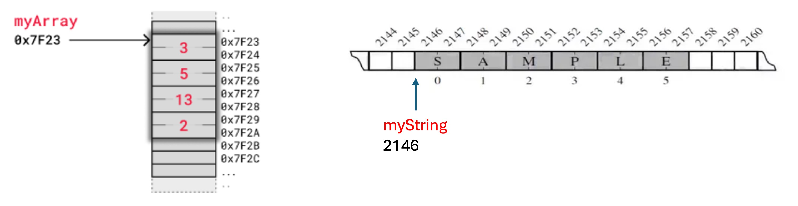

# Physical Data Structures
> Implement data structure in memory
<div class="grid">

<div>


</div>

<div>

<span class="small-text">

> A **sequential storage structure** is a method of storing data elements in <span class='blue-text'>physically contiguous memory locations </span> where the logical order of the data is the same as the physical order in memory. The primary data structure used to implement this storage method is an <span class='blue-text'>array</span>.

</span>

</div>

</div>

# Implement Sequential Storage Structure by Referential Arrays
> Python represents a list or tuple instance by an array of object references.
```python
primes = [2, 3, 5, 7, 11, 13, 17, 19]
temp = primes[3:6]
```


# Implement Sequential Storage Structure by Compact Arrays
> A compact array stores primary data instead of their references.
> Python represents a string or array.array instance by compact array.
```python
import array
myArray = array.array('i', [3, 5, 13, 2])
myString = "SAMPLE"
```



# Characteristics of Arrays
> Array is a data structure consisting of a collection of elements, of same memory size, each identified by an index. 
- Array size must be known when creating (by default static array)
- Stores elements in contiguous memory 
- Elements are of the same data type
- Each element can be accessed directly using its index
- Address of an element can be computed by [start_address] + ([index] * [size])


# Static Array is Not Good Enough, How Come?
> Arrays are implemented as a <span class="red-text">contiguous block of memory</span>. Once a static array is full, require <span class="red-text">array expansion </span> to add more elements.
- A new, larger array must be created.
- Elements must be transferred from the old array to the new one.


# Python Do Array Expansion Automatically
> The expansion process is handled internally, so you can treat the compact array (array.array) and referential array (list) as a dynamic array that can grow as needed.
```python
import array, sys
my_array = array.array('i')  # Create an empty array of integers
print(f"Length: {len(my_array)}, Size in bytes: {sys.getsizeof(my_array)}")

for i in range(1, 33):
    my_array.append(i)
    print(f"Length: {len(my_array)}, Size in bytes: {sys.getsizeof(my_array)}")
  
print(my_array)    
print('_' * 40, 'POP', '_' * 40)

print(f"Length: {len(my_array)}, Size in bytes: {sys.getsizeof(my_array)}")
for _ in range(32):
    my_array.pop()
    print(f"Length: {len(my_array)}, Size in bytes: {sys.getsizeof(my_array)}")
```

# Are Lists Arrays?
- Lists aren’t arrays
  - By default, arrays have a fixed length and an unique type
  - Lists are dynamic and can store elements of different types
  - But, list is the typical go-to data type for Python programmers needing an array structure
- List could be a referential array which doesn’t store actual values directly. Instead, it stores references (pointers) to objects in memory. That’s why lists can hold elements of different types and provide index-based access.
- a = [10, 20, 'GfG', 40, True]


# Python Do List Expansion Automatically
> Similar to array expansion, Python lists automatically resize themselves when they run out of space.
```python
import sys
my_list = []
print(f"Length: {len(my_list)}, Size in bytes: {sys.getsizeof(my_list)}")

for i in range(1, 33):
    my_list.append(i)
    print(f"Length: {len(my_list)}, Size in bytes: {sys.getsizeof(my_list)}")
  
print(my_list)    
print('_' * 40, 'POP', '_' * 40)

print(f"Length: {len(my_list)}, Size in bytes: {sys.getsizeof(my_list)}")
for _ in range(32):
    my_list.pop()
    print(f"Length: {len(my_list)}, Size in bytes: {sys.getsizeof(my_list)}")
```