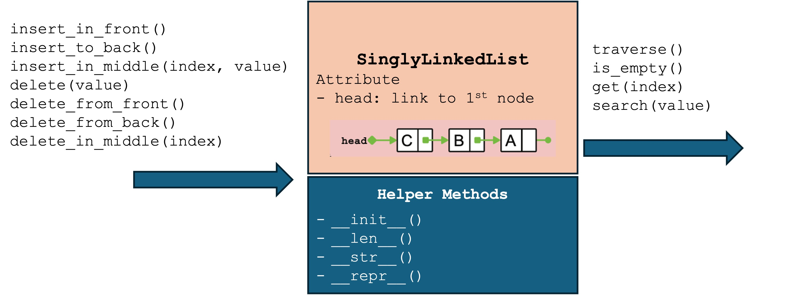
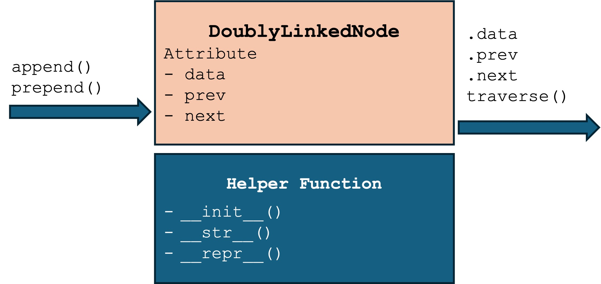

# Physical Data Structures
> Implement data structure in memory
<div class="grid">

<div>


</div>

<div>

<span class="small-text">

>A **linked storage structure** is a storage structure that <span class='blue-text'>uses references (links or pointers) to connect individual data records (nodes)</span>, rather than storing them in contiguous memory locations like an array. Each node contains both the data itself and a link to the next node in the sequence. The primary data structure used to implement this storage method is an <span class='blue-text'>linked list</span>.

</span>

</div>

</div>

# Implement Linked Storage Structure by Linked Lists
- A linked list is a linear data structure where each node contains a data part and a link to the next node. 
- The nodes are not stored in contiguous memory locations; instead, they are linked together using links (pointers).
- Node 3 -> 5 -> 13 -> 2


# Compare Linked List and Array
- Array elements are stored in contiguous memory. Linked list nodes are not stored contiguously.
- Linked list don't need allocate space in advance and copy data when add elements
- Linked list has no direct indexing
- Access an element in array and linked list is O(1) and O(n), respectively
- Insert an element in array and linked list is O(n) and O(1), respectively
- Delete an element in array and linked list is O(n) and O(1), respectively


# Design Singly Linked Node


# Implement Singly Linked Node
[ch04_singly_linked_node.py](code/ch04_singly_linked_node.py)

# Design Singly Linked List (SLL)

- Do not need specify a initial size
- Do not need same data type
- Insert
- Delete
- Query
  - Search by value
  - Get by index
  - Traverse
# Implement Singly Linked List (SLL)
[ch04_singly_linked_list.py](code/ch04_singly_linked_list.py)

# Design Doubly Linked Node


# Implement Doubly Linked Node
```python
class DoublyLinkedNode:
    def __init__(self, data):
        self._data = data
        self._next = None
        self._prev = None
        
    @property
    def data(self):
        return self._data

    @property
    def next(self):
        return self._next
    
    @property
    def prev(self):
        return self._prev

    def __str__(self):
        return str(self.data)

    def __repr__(self):
        return f"DoublyLinkedNode(data:{self._data}, id:{id(self)}, previous node id:{id(self._prev) if self._prev else None}, next node id:{id(self._next) if self._next else None})"
 
    def append(self, next_node):  # append a node to the current one
        self._next = next_node
        if next_node is not None:
            next_node._prev = self

    def prepend(self, prev_node):  # prepend a node to the current one.
        self._prev = prev_node
        if prev_node is not None:
            prev_node._next = self
            
    def traverse(self):
        current = self
        elements = []
        while current:
            elements.append(str(current.data))
            current = current.next       
        print(" None <- " + " <-> ".join(elements) + " -> None")
        
if __name__ == "__main__":
    # Example usage of the DoublyLinkedNode class
    node1 = DoublyLinkedNode(100)
    node2 = DoublyLinkedNode(200)
    node3 = DoublyLinkedNode(300)
    node1.append(node2)  # Link node1 to node2
    node3.prepend(node2)  # Link node3 back to node2
    print(f"Node 1 data: {node1.data}")   # Accessing like a variable, not a function
    print(repr(node1))
    print(f"Node 1 next node address: {id(node1.next)}")
    print(f"Node 2 prev node address: {id(node2.prev)}")
    print("Traversal:")
    node1.traverse()        
```

