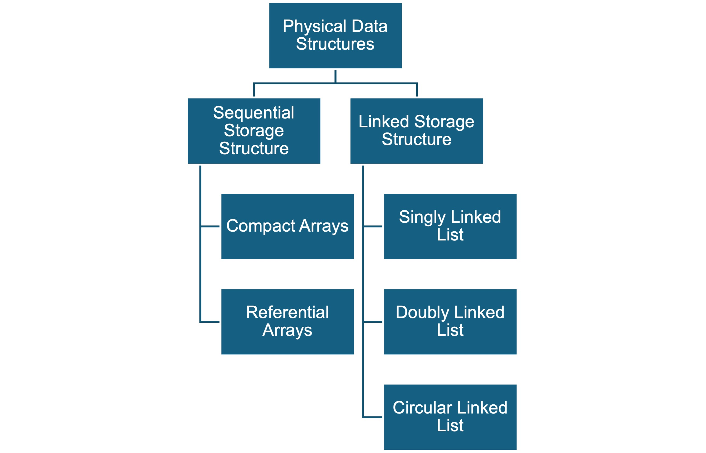
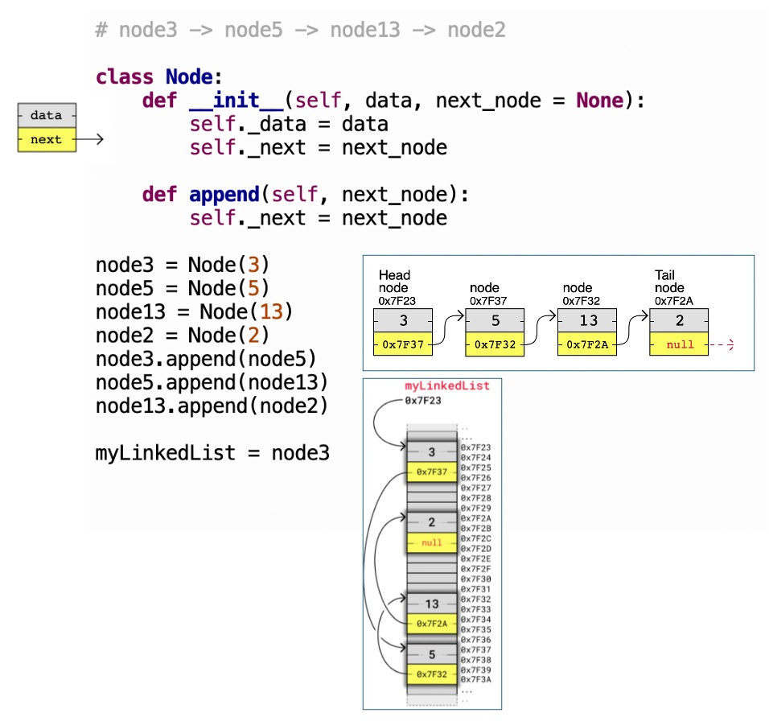
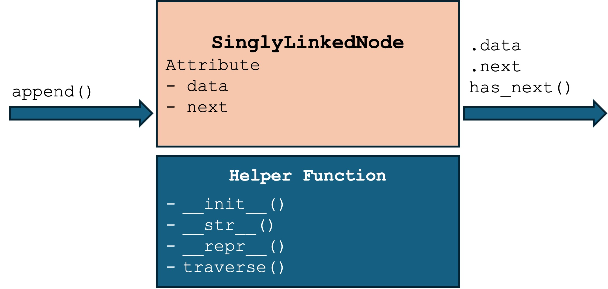

# Physical Data Structures
> Implement data structure in memory
<div class="grid">

<div>



</div>

<div>

<span class="small-text">

>A **linked storage structure** is a storage structure that <span class='blue-text'>uses references (links or pointers) to connect individual data records (nodes)</span>, rather than storing them in contiguous memory locations like an array. Each node contains both the data itself and a link to the next node in the sequence. The primary data structure used to implement this storage method is an <span class='blue-text'>linked list</span>.

</span>

</div>

</div>

# Implement Linked Storage Structure by Linked Lists
- A linked list is a linear data structure where each node contains a data part and a link to the next node. 
- The nodes are not stored in contiguous memory locations; instead, they are linked together using links (pointers).
- Node 3 -> 5 -> 13 -> 2



# Compare Linked List and Array
- Array elements are stored in contiguous memory. Linked list nodes are not stored contiguously.
- Linked list don't need allocate space in advance and copy data when add elements
- Linked list has no direct indexing
- Access an element in array and linked list is O(1) and O(n), respectively
- Insert an element in array and linked list is O(n) and O(1), respectively
- Delete an element in array and linked list is O(n) and O(1), respectively


# Implement Singly Linked Node


```python
class SinglyLinkedNode:
    """
    A singly linked list node
    """
    def __init__(self, data, next_node=None):
        self._data = data
        self._next = next_node

    @property
    def data(self):
        """Allows access to data via 'node.data' instead of 'node.data()'."""
        return self._data

    @property
    def next(self):
        """Allows access to the next node via 'node.next'."""
        return self._next

    def has_next(self):
        """Returns True if this node points to another node."""
        return self._next is not None

    def append(self, next_node):
        """Explicitly assigns the next node in the sequence."""
        self._next = next_node

    def __str__(self):
        """String representation of the data value."""
        return str(self._data)

    def __repr__(self):
        """Detailed view showing memory addresses for lecture debugging."""
        next_id = id(self._next) if self._next else None
        return f"Singly Linked List Node(data: {self._data}, id: {id(self)}, next node id: {next_id})"

    def traverse(self):
        """Prints the chain starting from this node."""
        current = self
        elements = []
        while current:
            elements.append(str(current.data)) # Note: using the @property here
            current = current.next             # Note: using the @property here
        print(" -> ".join(elements) + " -> None")

node1 = SinglyLinkedNode(100)
node2 = SinglyLinkedNode(200)

node1.append(node2)

print(f"Node 1 data: {node1.data}")   # Accessing like a variable, not a function
print(f"Node 1 next node address: {id(node1.next)}")
print("Traversal:")
node1.traverse()
print(node1)
print(repr(node1))
```

# Implement Doubly Linked Node


```python
class DoublyLinkedNode:
    def __init__(self, data):
        self._data = data
        self._next = None
        self._prev = None

    def __str__(self):
        return str(self.data())

    def __repr__(self):
        return f"DoublyLinkedNode(value:{self._data}, address:{id(self)}, previous:{id(self._prev) if self._prev else None}, next:{id(self._next) if self._next else None})"

    def data(self):
        return self._data

    def next(self):  # return the successor of the current node.
        return self._next

    def has_next(self):
        return self._next is not None

    def append(self, next_node):  # append a node to the current one
        self._next = ?????????
        if next_node is not None:
            next_node.????? = self

    def prev(self):  # return the predecessor of the current node.
        return self._prev

    def has_prev(self):  # check if the node has a predecessor
        return self._prev is not None

    def prepend(self, prev_node):  # prepend a node to the current one.
        self.????? = prev_node
        if prev_node is not None:
            prev_node._next = ????
```

