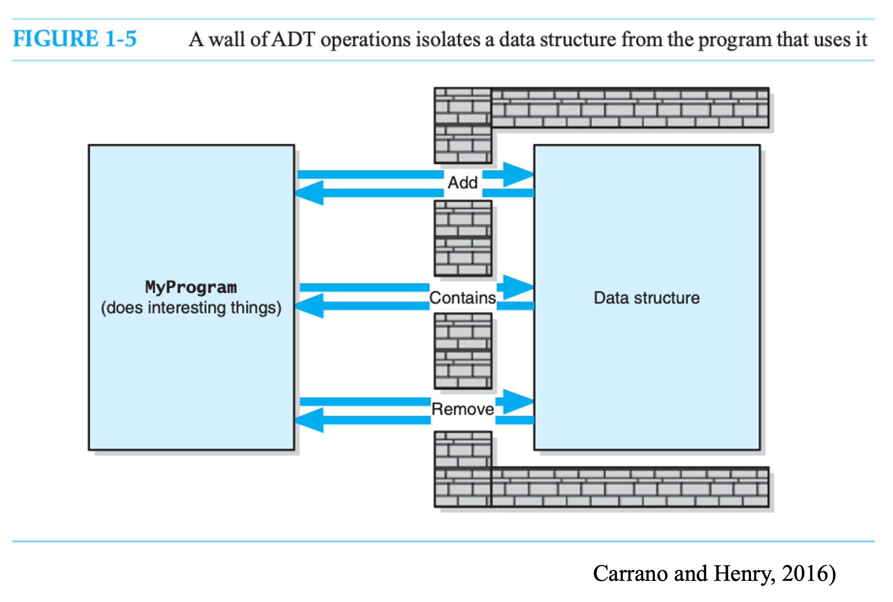
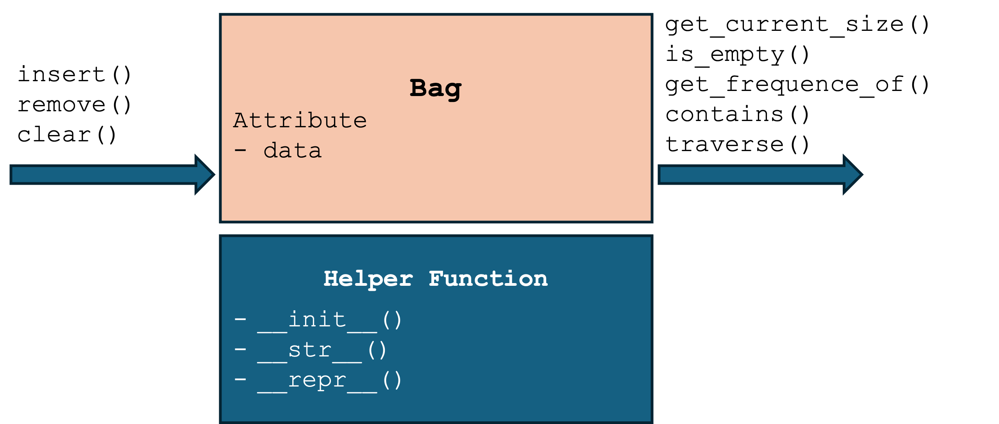

# Data Abstraction
> After learning basic programming, the next step is to understand data abstraction.
- Data Abstraction focuses on what the operations do to data, not on their implementation.
- Apply data abstraction to increase **modularity**.
- Conceptually, build a **“wall”** between a program and its data structures.


# Abstract Data Types
- **Abstract data type (ADT)** is a abstract model for data types, defined by its behavior from the point of view of data users specifically in terms of 
  - possible values
  - possible operations
  - behavior of operations 
- Data structures we learned before, array and linked node, which are concrete representations of data in memory, and are the point of view of an implementer, not a user.
- ADT example: a STACK has push/pop operations that follow a Last-In-First-Out rule, and can be concretely implemented using either a linked node or an array.

# Three-Level Hierarchy
- **Abstract data type**: a theoretical concept that describes at a high level how data can be organized and the operations that can be performed on the data.
- **Data structure**: how data is organized in memory and the internal representation details of the DS
- **Implementation**: choose a programming language and translate the DS into code.


# A simple ADT: Bag
#### Bag is a container containing a finite number of objects.
- Objects in a bag have no particular order.
- Objects in a bag may be duplicated.
- Objects in a bag may be different types.


# Behaviors of Bag
> Specifications indicate what the operations do, not how to implement
- Insert/remove/clear:
  – Add a given object to the bag. The order of addition is not important.
  – Remove an occurrence of a specific object from the bag.
  – Remove all objects from the bag.
- Counting:
  – Get the number of items currently in the bag (get_current_size)
  – See whether the bag is empty (is_empty)
  – Count the number of a specific item in the bag (get_frequency_of)
- Query:
  – Test whether the bag contains a particular object. (contains)
  – Go through all objects in the bag. The order is not guaranteed. (traverse)

# Using the ADT Bag to Build a Card Guessing Game
```python
# Pseudocode, Initialize the bag with some cards
cards ← ["Ace", "Two", "Three", ..., "King"]
CREATE card_bag as a new Bag
INSERT cards[1], cards[2], cards[4], cards[8], cards[10], cards[12] INTO card_bag
TRAVERSE card_bag

# Start guessing game
total_guess ← 0
while card_bag not IS_EMPTY DO
    total_guess ← total_guess + 1
    guess = prompt user to input a number (1 ~ 13)
    card ← cards[guess - 1]
    if card_bag CONTAINS card then
        print "You get the card!"
        REMOVE card from card_bag
    else
        print "Sorry, card was not in the bag."
    end if
end while
print('game over! total guesses: ', total_guess)
```

# Implement Bag by Referential Array - List
```python
class Bag:
    def __init__(self):
        self._data = SinglyLinkedList()

    def insert(self, value):
        self._data.insert_in_front(value)

    def iterate(self):
        return self._data.traverse()        
```