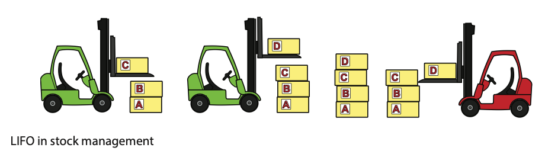
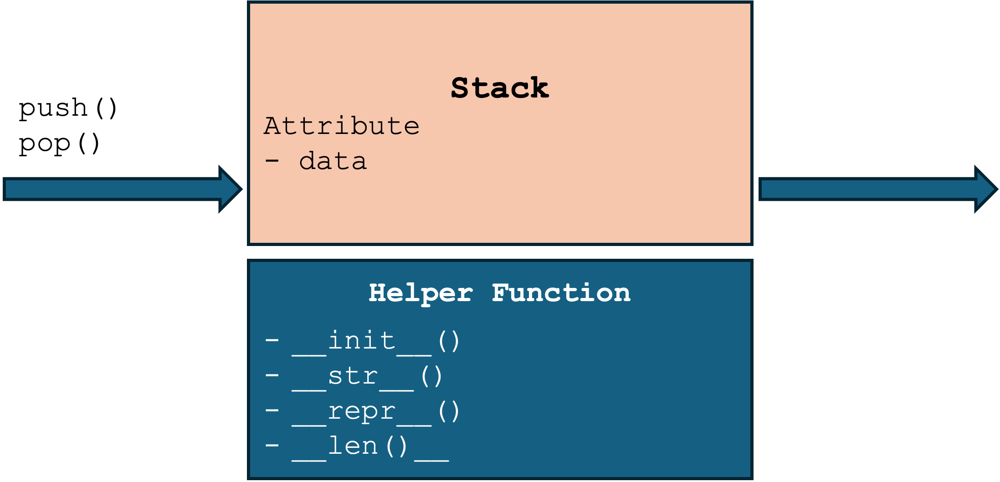
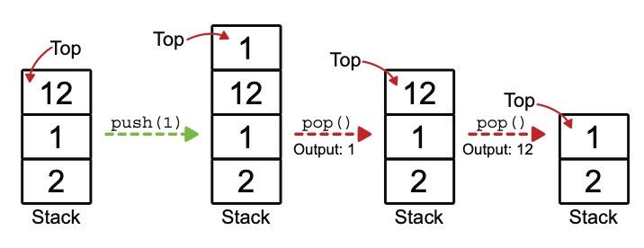
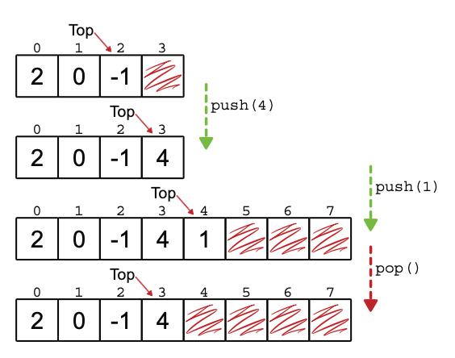
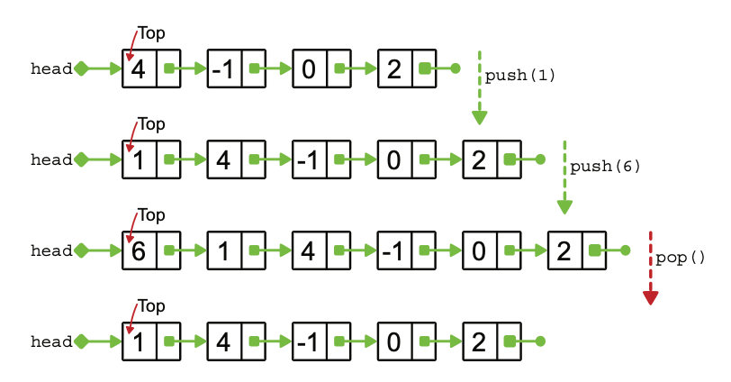
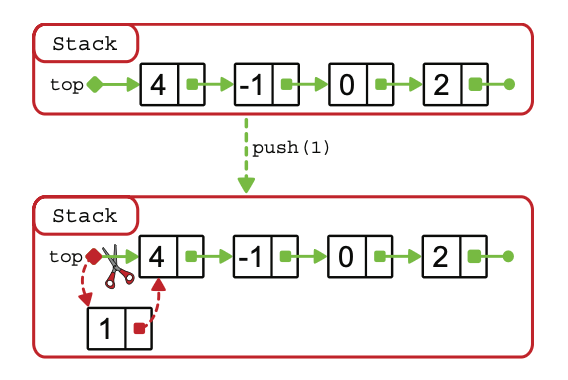
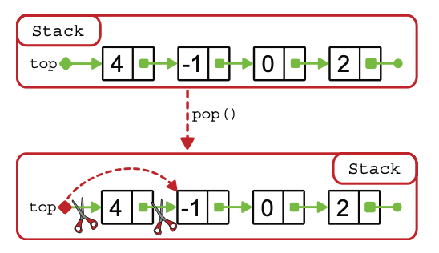
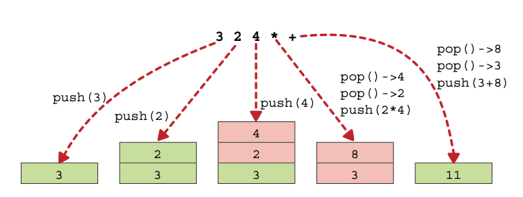
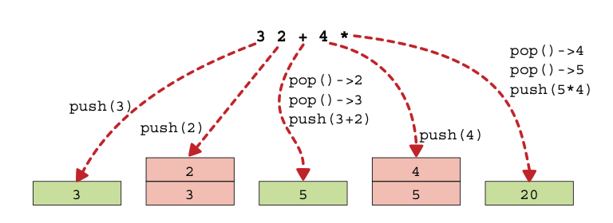

# Stacks

- **Stack** is a container that allows elements to be added or removed according to LIFO rule (last in, first out).
- Example: stack of plates, browser history, undo mechanism in text editors, call stack in programming languages, etc.

# ADT: Stack
Stack follows LIFO rule, we design its interface with only two methods:
- Push(): insert an element into the stack
- Pop() or Top(): remove the most recently added element from the stack and return it
- We also need to keep track of the last element that was added to the stack, is called the **top** of the stack. 
<div class="columns">
    
    
</div>

# Design Stack Upon Array and SLL
- Array: referential array - Python list
- Linked list: singly linked list (SLL)
<div class="middle-grid">
    
    
    
    
</div>

# Implement by List
[code/ch06_stack_list.py](code/ch06_stack_list.py)

# Lab of Stack by List
```
class Stack:
    def __init__(self):
        self._data = ??

    def __???__(self):
        # Return the size of the stack.
        return len(self._data)

    def push(self, value):
        # Add a new value to the stack.
        self._data.?????(value)

    def pop(self):
        # Remove and return the last value added to the stack.
        if self.is_empty():
            raise ValueError("Cannot pop from an empty stack")
        return self._data.???()

    def peek(self):
        # Return the last value added to the stack without removing it.
        if self.is_empty():
            raise ValueError("Cannot peek at an empty stack")
        return self._data[??]
```

# Implement by SLL
[code/ch06_stack_sll.py](code/ch06_stack_sll.py)

# Lab of Stack by SLL
```
from ch04_singly_linked_list import SinglyLinkedList
class Stack:
    def __init__(self):
        self._data = ????????????????()

    def __len__(self):
        # Return the size of the stack.
        return len(self._data)

    def is_empty(self):
        return self._data.is_empty()

    def push(self, value):
        # Add a new value to the stack.
        self._data.insert_in_?????(value)

    def pop(self):
        # Remove and return the last value added to the stack.
        if self.is_empty():
            raise ValueError("Cannot pop from an empty stack")
        return self._data.delete_from_?????()

    def peek(self):
        # Return the last value added to the stack without removing it.
        if self.is_empty():
            raise ValueError("Cannot peek at an empty stack")
        return self._data.?????.data
```

# Stack Application - Evaluating Expression
- Infix notation: 3 + 2
- Postfix notation: 3 2 +
- In infix notation, 3 + 2 * 4 => 3 + (2 * 4) based on operator precedence, if we want to add 3 and 2 first, the formula will be (3 + 2) * 4
- In postfix notation, we use 3 2 4 * + and 3 2 + 4 * respectively

<div class="columns">
    
    
</div>

# Stack Application - Infix to Postfix Conversion
因爲 infix 的計算較複雜，電腦會先將infix轉成postfix再算, infix轉換成postfix的方法如下
1. 由左而右讀infix，一次讀取一個token: [operator + - * / ()] 或 [operand 1 2 x y]
2. 如果是operand，直接輸出
3. 如果是operator，則必須根據operator stack的規則決定 push 或 pop
4. 所有token讀完後，如果 operator stack 不是空的，則將 operator 依序 pop 出來
5. operator stack rule
  - A：'(' 一律 push
  - B: ')' 需重複 pop operator stack中的operator，直到遇見')'一同抵銷
  - C: operator在stack中只能優先序大的壓小的。如果外面的operator優先序較大，則 push。否則（小於等於）就一直做 pop，直到遇見優先序較小的運算子或堆疊為空，再把外面的運算子 push 到 operation stack 中。

# Illustration of Infix to Postfix Conversion
> (A + B) * C - D / E ==> A B + C * D E / -
>  5 + 3 * 2 ==> 5 3 2 * +
> A + (B * (C - D) / E) ==> A B C D - * E / +

<style scoped>
table {
  font-size: 12px;
}
</style>
| Step | Token | Action             | Stack (Bottom → Top)| Postfix|
|------|-------|--------------------|---------------------|--------|
|1     |  (    | push               | (                   |        |
|2     |  A    | output             | (                   | A      |
|3     |  +    | push               | ( +                 | A      |
|4     |  B    | output             | ( +                 | A B    |
|5     |  )    | pop until (        |                     | A B +  |
|6     |  *    | push               | *                   | A B +  |
|7     |  C    | output             | *                   | A B + C|
|8     |  -    | pop *, then push - | -                   | A B + C *|
|9     |  D    | output             | -                   | A B + C * D|
|10    |  /    | push               | - /                 | A B + C * D|
|11    |  E    | output             | - /                 | A B + C * D E|
|12    | End   | pop all            |                     | A B + C * D E / -|

# Stack Application
[code/ch06_stack_applications.ipynb](code/ch06_stack_applications.ipynb)

# Recap
- A stack is a ADT that abides by the LIFO policy.
- Stacks provide two operations: push and pop. No other way to insert or delete elements, and search is generally not allowed.
- A stack can be implemented using either arrays or linked lists to store its elements.

# Review Questions
1.	Which operations characterize a stack?
下列何者為 Stack（堆疊）的操作特性？
(a)Insert/Delete (b)Push/Pop (LIFO) (c)Enqueue/Dequeue (FIFO) (d)Sort/Merge

2.	Given the following stack operations:
以下堆疊操作的兩次 pop() 輸出為何？
push(1), push(2), push(3), pop(), push(4), pop()
What are the outputs of the two pop() operations?
(a)3, 4 (b)3, 2 (c)2, 4 (d)4, 3

3. Implement a Stack Class using Python’s built-in list. 
Your implementation should include the following four methods:
(5%) function __init__(self), (5%) function __len__(self)
(5%) function push(self, value), (5%) function pop(self)


