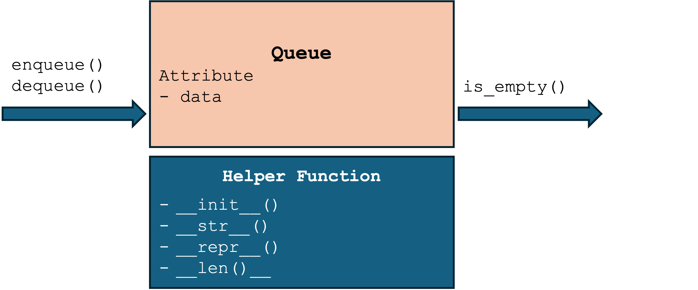

# Queues

- **Queue** is a container that allows elements to be added or removed according to FIFO rule (first in, first out).

# ADT: Queue
Queue follows FIFO rule, we design its interface with only two methods:
- Enqueue(): insert an element into the queue
- Dequeue(): remove the least recently added element from the queue and return it

    
    

# Design Queue Upon Array and SLL
- Array: referential array - Python list
- Linked list: singly linked list (SLL)

    
    

# Implement by List
[code/ch07_queue_list.py](code/ch07_queue_list.py)

# Implement by SLL
[code/ch07_queue_sll.py](code/ch07_queue_sll.py)
    
# (LeetCode 232) Implement Queue using Stacks

# Recap
- A queue is a container that adheres to the FIFO policy
- Queues are widely used in computer science and programming, including messaging systems, networking, web servers, and operating systems
- Queues provide two operations: enqueue and dequeue
