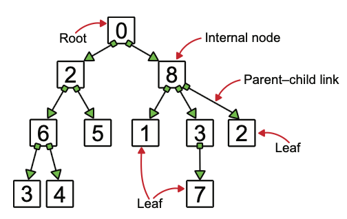
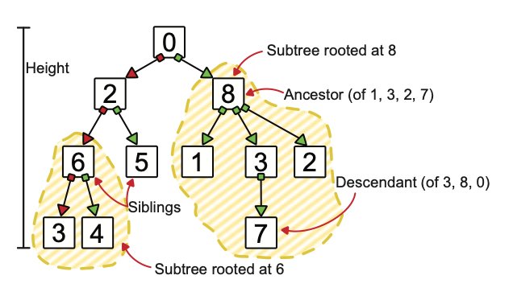
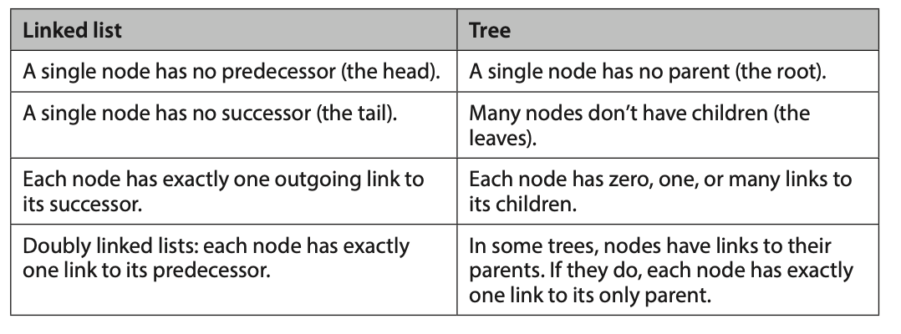
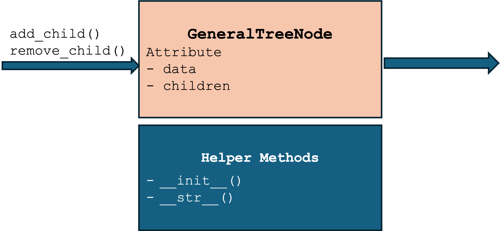
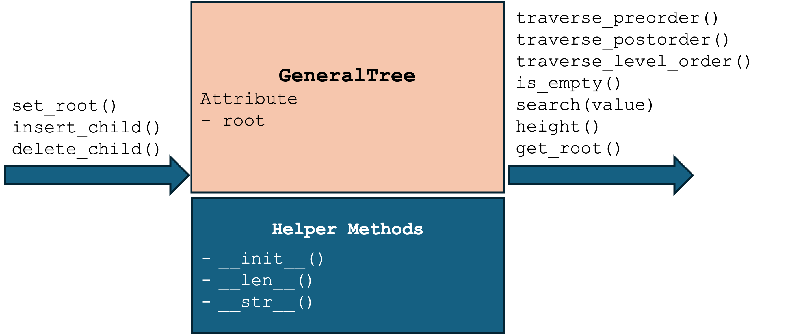

# Trees

- A generic **tree** is a non-linear data structure that consists of nodes connected by links. 
- Each node contains a value and a number of links to other nodes, from zero to some number k (k-ary tree)

# Terminology of Tree (1/3)
- Root: no other node in the tree points to the root (0)
- Parent and Child node: a node P has a link to another node C, then P is called the **parent** of C, and C is a **child** of P. 0 is the parent node of two child nodes: 2 and 8
- Leaf: a node has no links to children (5, 1, 2, 3, 4, 7)
- Internal node: node has child nodes (2, 8, 6, 3)
- No loop in a tree: any path from the root to a leaf, you never see the same node twice

# Terminology of Tree (2/3)
- Ancestor: node N is an ancestor of node M if N is in the path between the root and M. 
- Descendant: a descendant of a node N is either one of the children of N or the descendant of one of the children of N. Node 8 is an ancestor of node 7.
- Sibling: All children of the same node are siblings.
- Subtree: a portion of the tree containing a node R and all the descendants of R.
- Height: the length of the longest path from the root to a leaf
<div class="middle-grid">
    
</div>

# Terminology of Tree (3/3)
- Level of a node: the number of connections between the node and the root. Root is at level 0.
- Depth of a node: the length of the path from the root to the node. Root has depth 0.
- Degree of a node: the number of children of the node.
- Degree of a tree: the maximum degree of all nodes in the tree.
- Height of a node: the maximum number of edges between the node and a leaf node.
- Height of tree: the maximum number of edges from the root node to a leaf node. A tree with only one node (the root) has height 0.

# Supplementary Resources
[Geeks for geeks](https://www.geeksforgeeks.org/dsa/introduction-to-tree-data-structure/)
[W3Schools](https://www.w3schools.com/dsa/dsa_theory_trees.php)

# Compare Linked List to Trees


# Design General Tree Node

[code/ch09_general_tree_node.py](code/ch09_general_tree_node.py)

# Lab of General Tree Node
```python
class GeneralTreeNode:
    def __init__(self, data):
        self._data = data
        self._children = ??

    def add_child(self, child_node):
        """Adds a GeneralTreeNode instance to the children list."""
        self._children.??????(child_node)

    def remove_child(self, child_node):
        """Removes a GeneralTreeNode instance from the children list."""
        self._children.??????(child_node)
```

# ADT: (General) Tree

[code/ch09_general_tree.py](code/ch09_general_tree.py)

# Tree Traversal Techniques
- 深度優先走訪 (Depth-First Search, DFS), 盡可能深地探索每一條分支，再 Backtrack
    - 前序走訪 (Pre-order): 根 -> 左子樹 -> 右子樹。
    - 中序走訪 (In-order): 左子樹 -> 根 -> 右子樹。
    - 後序走訪 (Post-order): 左子樹 -> 右子樹 -> 根。
- 廣度優先走訪 (Breadth-First Search, BFS):  由上至下、由左至右逐層訪問節點

<div class="columns">
    
    
</div>

# Lab of (General) Tree (1/3)
```python
from ch08_general_tree_node import GeneralTreeNode
class GeneralTree:
    def insert_child(self, parent_node, child_node):
        """Inserts a new child node with `child_node` under `parent_node`."""
        parent_node.?????????(child_node)
        return True    

    def delete_child(self, parent_node, child_node):
        """Deletes `child_node` from the children of `parent_node`."""
        parent_node.????????????(child_node)
    
    def search(self, target_data):
        """Searches for a node with `target_data` in the tree."""
        def _search_recursive(node):
            if node._data == target_data:
                return node
            for child in node._children:
                result = _search_recursive(?????)
                if result is not None:
                    return result
            return None

        if self.is_empty():
            return None
        return _search_recursive(self._root)
    
    def height(self):
        """Calculates the height of the tree."""
        def _height_recursive(node):
            if not node._children:
                return 0
            return 1 + ???(_height_recursive(child) for child in node._children)

        if self.is_empty():
            return -1
        return _height_recursive(self._root)

```

# Lab of (General) Tree (2/3)
```python    
    def traverse_preorder(self):
        """Performs a preorder traversal of the tree and returns a list of node data."""
        result = []

        def _preorder_recursive(node):
            result.append(node._data)
            for child in node._children:
                _preorder_recursive(child)

        if not self.is_empty():
            _preorder_recursive(self._root)
        return result   
    
    def traverse_postorder(self):
        """Performs a postorder traversal of the tree and returns a list of node data."""
        result = []

        def _postorder_recursive(node):
            for child in node._children:
                _postorder_recursive(child)
            result.append(node._data)

        if not self.is_empty():
            _postorder_recursive(self._root)
        return result
    
    def traverse_level_order(self):
        """Performs a level-order traversal of the tree and returns a list of node data."""
        result = []
        if self.is_empty():
            return result

        queue = [self._root]
        while queue:
            current_node = queue.pop(0)
            result.append(current_node._data)
            queue.extend(current_node._children)
        return result

```

# Lab of (General) Tree (3/3)
[](https://youtu.be/8xue-ZBlTKQ?si=3-2waP6yEhqYN80B)

# Recap
- A generic tree is a non-linear data structure that consists of nodes connected by links.
- Each node contains a value and a number of links to other nodes, from zero to some number k (k-ary tree).
- We can define a GeneralTreeNode class to represent each node in the tree, and a GeneralTree class to manage the overall tree structure and operations.
- Tree traversal techniques include depth-first search (DFS) and breadth-first search (BFS), which allow us to visit all nodes in a specific order.

# Supplement
**LeetCode 589: N-ary Tree Preorder Traversal**
Parse an N-ary tree described as [1, None, 3, 2, 4, None, 5, 6] and return the preorder traversal of its nodes' values.

[ch09_nary_tree_leetcode_589.py](code/ch09_nary_tree_leetcode_589.py)