# Binary Tree
Binary trees are defined by restricting each node to a maximum of two children.
- In a binary tree, a node may have zero, one, or two child links. 
- There are left children and right children of a node, and thus its left and right subtrees
 
<div class="middle-grid">
    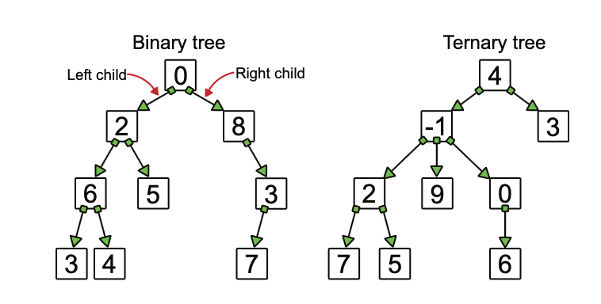
</div>

# Binary Tree Types
- Full Binary Tree: every node other than the leaves has two children.
- Perfect Binary Tree: all internal nodes have two children and all leaves are at the same level. (all levels are completely filled)
- Complete Binary Tree: all levels are completely filled except possibly the last level, and the last level has all keys as left as possible.
- Balanced Binary Tree: a binary tree in which the height of the two subtrees of any node never differ by more than one.
- Degenerate and Skewed Tree: each parent node has only one child. Such trees behave like linked lists.

# Binary Tree Illustration


# Binary Tree Properties
- The max number of nodes at level 'l' of a binary tree is 2<sup>l</sup>, where root is at level 0.
- The max number of nodes in a binary tree of height 'h' is 2<sup>(h+1)</sup> - 1.
- In a binary tree, n<sub>0</sub> = n<sub>2</sub> + 1, where n<sub>0</sub> is the number of leaf nodes and n<sub>2</sub> is the number of nodes with two children.
- With 'n' nodes, the min possible height is ⌈log<sub>2</sub>(n + 1)⌉ − 1 under complete or perfect binary tree
- In a complete binary tree, given a node with an index i > 0, its parent’s index is (i - 1) // 2, and its children's indexes are (2 * i + 1) and (2 * i + 2)
# Prove max # of nodes in a binary tree of height 'h'
2<sup>0</sup> + 2<sup>1</sup> + 2<sup>2</sup> + ... + 2<sup>h</sup> = 2<sup>(h+1)</sup> - 1

**Geometric Series Sum Formula** 

$$S_n = \frac{a_1(r^n - 1)}{r - 1}$$

* **$S_n$**: The sum of the first $n$ terms of the sequence.
* **$a_1$**: The first term of the sequence.
* **$r$**: The common ratio (where $r \neq 1$).
* **$n$**: The number of terms.

  
# Prove n<sub>0</sub> = n<sub>2</sub> + 1
- Node number: n = n<sub>0</sub> + n<sub>1</sub> + n<sub>2</sub>
- Edge number: n - 1 = 0 * n<sub>0</sub> + 1 * n<sub>1</sub> + 2 * n<sub>2</sub>
- Therefore, n<sub>0</sub> + n<sub>1</sub> + n<sub>2</sub> = 1 * n<sub>1</sub> + 2 * n<sub>2</sub> + 1

# Prove the min possible height with 'n' nodes
- The min possible height of a binary tree with n nodes is achieved when the tree is complete or perfect, which means all levels are completely filled except possibly the last level, and the last level has all keys as left as possible.
- If we have n nodes, and we want to find the minimum height h, we know that n cannot exceed the capacity of a perfect tree of that height. Therefore:
$n \leq 2^{h+1} - 1$
$n + 1 \leq 2^{h+1}$
$\log_2(n + 1) \leq h + 1$
$\log_2(n + 1) - 1 \leq h$
### Minimum height: $⌈\log_2(n + 1)⌉ − 1$

# Design Binary Tree Node
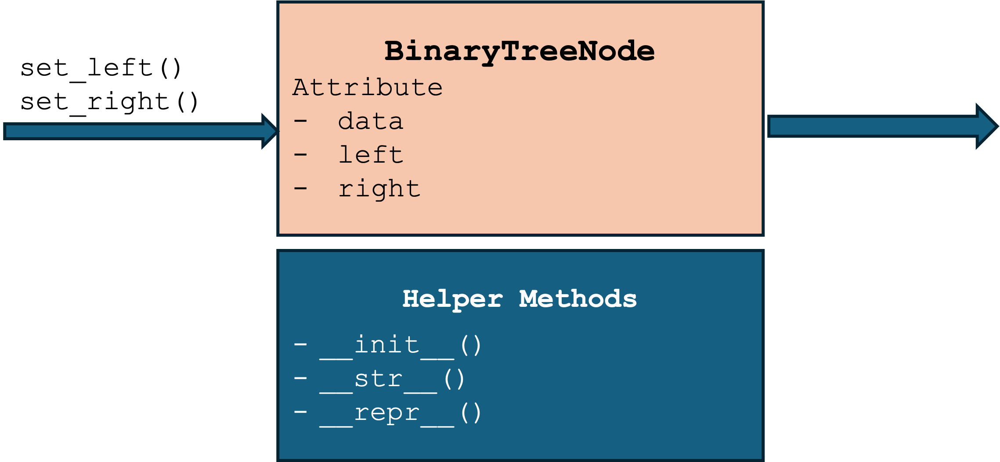
[code/ch10_binary_tree_node.py](code/ch10_binary_tree_node.py)

# Lab of Binary Tree Node
```python
class BTNode:
    def __init__(self, data, left=None, right=None):
        self._data = data
        self._left = left
        self._right = right

    @left.setter
    def left(self, node):
        self._left = ????

    @right.setter
    def right(self, node):
        self.?????? = node

```

# ADT - Binary Tree
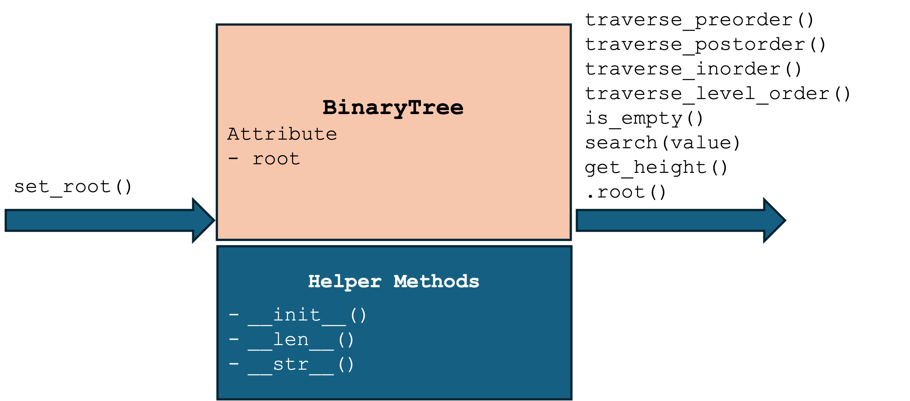
[code/ch10_binary_tree.py](code/ch10_binary_tree.py)

# Lab of Binary Tree (1/2)
```python
def __init__(self):
        self._root = None

def set_root(self, root_data):
    """Sets the root node of the tree to `node`."""
    self._root = ??????(root_data)

def __len__(self):
    """Returns the number of nodes in the tree."""

    def _count_nodes(node):
        if node is None:
            return 0
        return 1 + _count_nodes(node.????) + _count_nodes(node.?????)
    return _count_nodes(self._root)

def get_height(self, node):
    """Calculates how many steps to the furthest leaf."""
    if node is None:
        return -1
    return 1 + ???(self.get_height(node.left), self.get_height(node.right))

def search(self, target):
    """Checks if the tree contains a node with `target` data."""

    def _contains_recursive(node):
        if node is None:
            return False
        if node.data == target:
            return True
        return _contains_recursive(node.left) ?? _contains_recursive(node.right)

    return _contains_recursive(self._root)

```

# Lab of Binary Tree (2/2)
```python
def traverse_in_order(self, node):
    result = []

    def _in_order_recursive(cur):
        if cur is not None:
            _in_order_recursive(cur.left)
            result.??????(cur.data)
            _in_order_recursive(cur.right)

    _in_order_recursive(node)
    return result

def traverse_preorder(self, node):
    result = []

    def _preorder_recursive(cur):
        if cur is not None:
            result.append(cur.data)
            _preorder_recursive(cur.????)
            _preorder_recursive(cur.?????)

    _preorder_recursive(node)
    return result

def traverse_postorder(self, node):
    result = []

    def _postorder_recursive(cur):
        if cur is not None:
            ??????????_recursive(cur.left)
            ??????????_recursive(cur.right)
            result.append(cur.data)

    _postorder_recursive(node)
    return result

def traverse_level_order(self):
    """Performs a level-order traversal of the tree and returns a list of node data."""
    result = []
    if self.is_empty():
        return result

    queue = [self._root]

    while ?????:
        current = queue.???(0)
        result.append(current.data)

        if current.left is not None:
            queue.append(current.left)
        if current.right is not None:
            queue.append(current.right)

    return result

```

# Binary Tree Applications:
- **Huffman Coding Trees**: used in data compression algorithms.
- **Binary Search Trees (BST)**: used for efficient searching and sorting.
- **Heaps**: used in priority queues and heap sort algorithms.

# Huffman Coding Tree
| Tutorial 1 | Tutorial 2 |
| :---: | :---: |
| [](https://youtu.be/6K4aZiwq1Jk) | [](https://youtu.be/d3gHFesPc_E) |
| *Basics of Construction* | *Advanced Examples* |

# Construct Huffman Coding Tree
- Given the following characters and their frequencies, construct a Huffman coding tree: A: 45, B: 13, C: 12, D: 16, E: 9, F: 5
- Steps to construct the tree:
  1. Create a leaf node for each character and build a list of all leaf nodes sorted by their frequencies with ascending order.
  2. While there is more than one node in the list:
     - Extract the two nodes of the lowest frequency from the list.
     - Create a new internal node with these two nodes as children and with frequency equal to the sum of their frequencies.
     - Insert the new node back into the list.
  3. The last remaining node in the list is the root of the Huffman tree.

# Implement Huffman Coding Tree
[code/ch10_huffman_coding_tree.py](code/ch10_huffman_coding_tree.py)

# Illustrate Huffman Coding Tree
- A: 45, B: 13, C: 12, D: 16, E: 9, F: 5
- Huffman codes: A: 0, B: 101, C: 100, D: 111, E: 1101, F: 1100

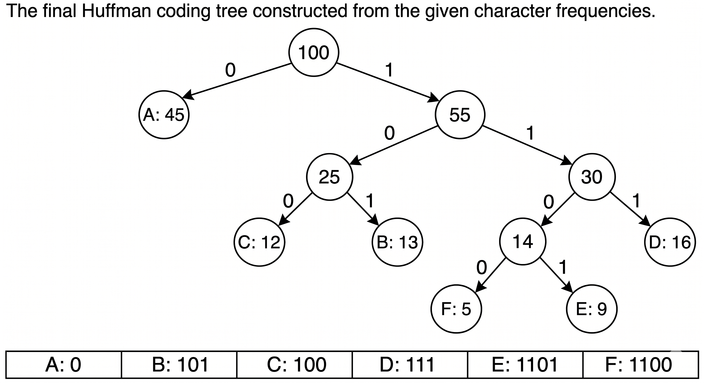

# Binary Search Trees
A binary search tree (BST) has some properties
- It’s a tree
- It’s binary, so each node has (optionally) a left and a right child
- It’s used for searching
- BST is potentially as fast as binary search on a sorted array.
- Insertion and deletion on BST can be faster than sorted arrays
- BST need more memory and more complicated than sorted array   

# BST is Order Matters
In BST, for any node N that stores a value v, all nodes in the left subtree of N will have values less than or equal to v, and all nodes in the right subtree of N will have values greater than v

<div class="middle-grid">
    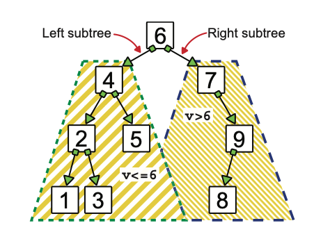
</div>

# Find the Minimum and Maximum Elements in a BST
- Get the maximum element, we start at the root and follow the links to the right children until we reach a node that has no right child. This node (which could be the root itself) stores the maximum value in the tree.
- Get the minimum element, we start at the root and follow the links to the left children until we reach a node that has no left child.
<div class="middle-grid">
    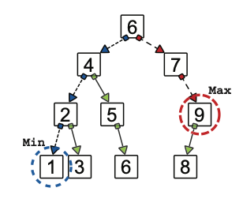
</div>


# Design BST Node
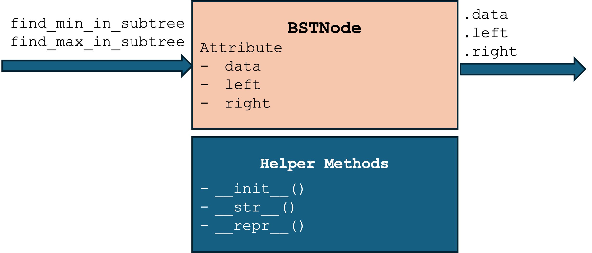
[code/ch10_bst_node.py](code/ch10_bst_node.py)

# Lab of BST Node
```python
class BSTNode:
   
    def __init__(self, data, left=None, right=None):
        self._data = data
        self._left = left
        self._right = right

    def find_min_in_subtree(self):
        # Return the node with the smallest value in the subtree rooted at the node, and its parent
        parent = None
        node = self
        while node.???? is not None:
            parent = node
            node = node.????
        return node, parent

    def find_max_in_subtree(self):
        # Return the node with the largest value in the subtree rooted at the node, and its parent.
        parent = None
        node = self
        while node.????? is not None:
            parent = node
            node = node.?????
        return node, parent
```

# Design BST
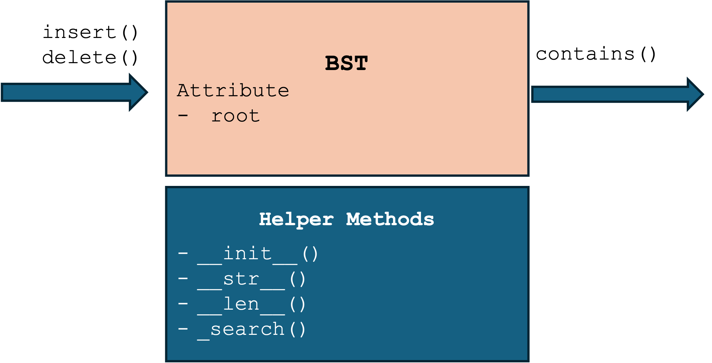
[code/ch10_bst.py](code/ch10_bst.py)

# Design BST Search
<div class="middle-grid">
    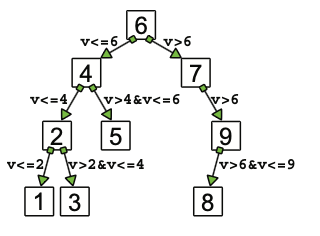
    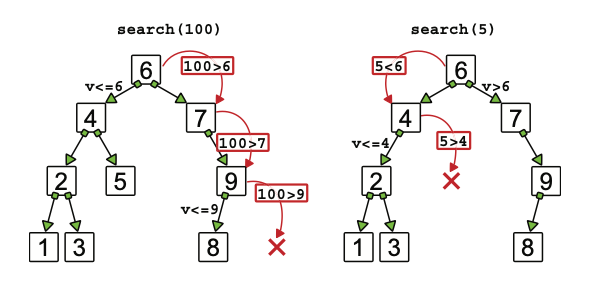
</div>
The search method follows a single path, from the root to (possibly) a leaf, means that it will take no more steps than the height of the tree — it needs O(h) comparisons, where h is the height of the tree.

# Implement BST Search
```python
def _search(self, value):
    parent = None
    node = self._root
    while node is not None:
        node_val = node.data
        if node_val ?? value:
            return node, parent
        elif value ? node_val:
            parent = node
            node = node.left
        else:
            parent = node
            node = node.?????
    return None, None
```

# Design BST Insert
<div class="middle-grid">
    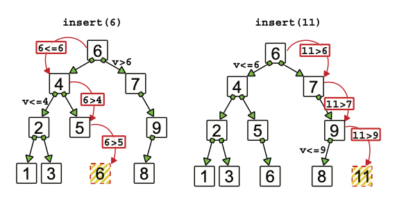
</div>

- In general, when we get to a node, we first check the value it stores to understand which branch we need to traverse and whether we need to go left or right. 
- Suppose we figure out that we need to go right. If the node has no right child, we have found the place where we have to add the new element. 
- All we have to do is create a new node and attach it as a right child of the current node. 

# Implement BST Insert
```python
def insert(self, value):
        node = self._root
        if node is None:  # Empty tree
            self._root = BSTNode(value)
            return None

        while node is not None:
            if value <= node.data:
                if node.left is ????:
                    node.left = BSTNode(value)
                    break
                else:
                    node = node.????  # We keep traversing the left branch
            elif node.right is None:
                node.????? = BSTNode(value)
                break
            else:
                node = node.?????  # We keep traversing the right branch
```

# Design DST Delete (1/2)
 - Case 1: delete a leaf
 - Case 2: delete a node with only one child
 - Case 3: delete a node having two children

<div class="middle-grid">
    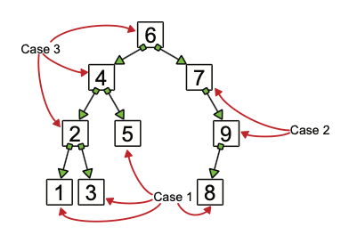
    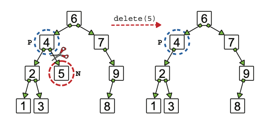
    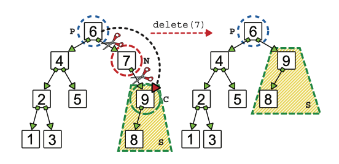
</div>

# Design DST Delete (2/2)
<div class="middle-grid">
    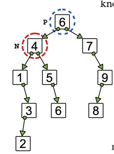
    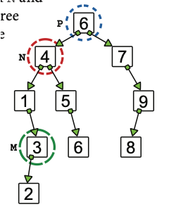
    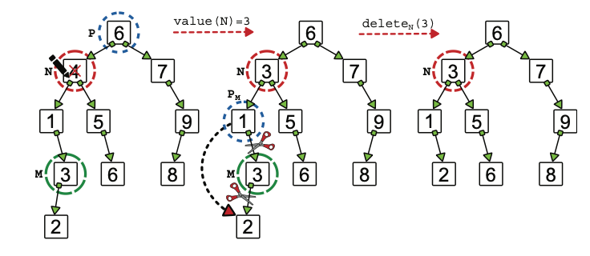
</div>

# Implement BST Delete
```python
def delete(self, value):
    if self._root is None:
        raise ValueError("Delete on an empty tree")
    node, parent = self._search(value)
    if node is None:
        raise ValueError("Value not found")

    if node.left is None or node.right is None:
        if node.left is None:
            maybe_child = node.right
        else:
            maybe_child = node.left

        # The node has at most only one child
        if parent is None:
            # The node is the root
            self._root = maybe_child
        elif value <= parent.data:
            parent.left = maybe_child
        else:
            parent.right = maybe_child

    else:  # The node N has two children.
        # Find and remove the node M with the largest value in the left subtree of N.
        max_node, max_node_parent = node.left.find_max_in_subtree()
        if max_node_parent is None:  # M is the left child of N.
            new_node = BSTNode(max_node.data, None, node.right)
        else:
            # Then  replace the node to be deleted with a new node with M.value(),
            new_node = BSTNode(max_node.data, node.left, node.right)
            max_node_parent.set_right(max_node.left())

        if parent is None:
            # The node is the root
            self._root = new_node
        elif value <= parent.data:
            parent.left = new_node
        else:
            parent.right = new_node
```
# Illustrate BST Delete
<div class="middle-grid">
    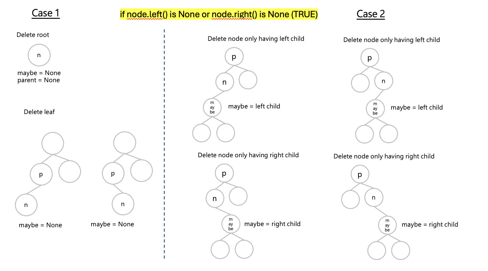
    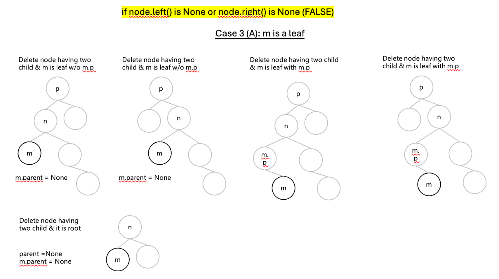
    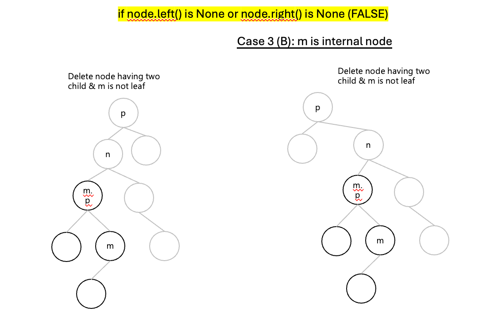
</div>

# Tree Category
<div class="columns">
    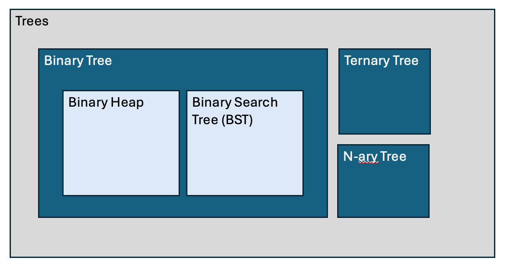
</div>

