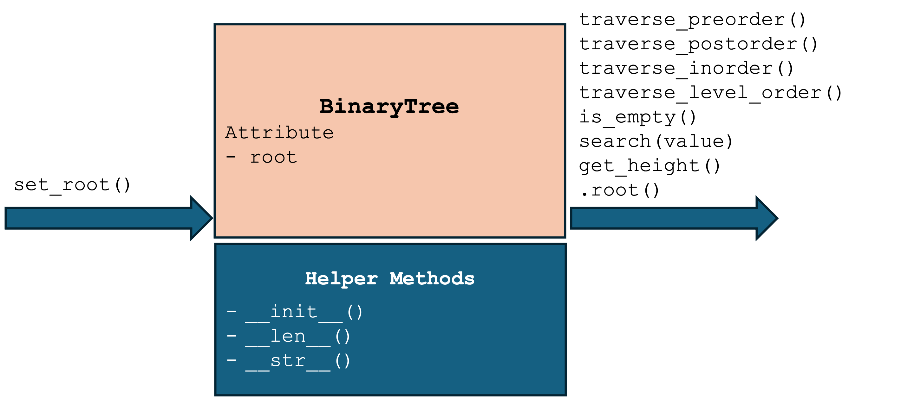

# Graphs
A Graph is a non-linear data structure that consists of vertices (nodes) and edges.
- Vertices (or nodes) represent entities or data points.
- Edges represent the relationships or connections between these entities.

    

# Graph Properties
- A **weighted** Graph is a Graph where the edges have values.
- A **connected** Graph is when all the vertices are connected through edges.
- A **directed** Graph is when the edges between the vertex pairs have a direction.
- A **cyclic** Graph is defined differently depending on whether it is directed or not:
  - A **directed cyclic** Graph is when you can follow a path along the directed edges that goes in circles.
  - An **undirected cyclic** Graph is when you can come back to the same vertex you started at without using the same edge more than once.
- A **loop**, also called a self-loop, is an edge that begins and ends on the same vertex.
- Degree of a vertex is the number of edges connected to it. In a directed Graph, we have in-degree and out-degree.
[W3 School: Graph properties](https://www.w3schools.com/dsa/dsa_theory_graphs.php)

# Graph Representation
- **Adjacency Matrix**: a 2D array where the cell at row i and column j indicates the presence (and possibly weight) of an edge between vertex i and vertex j.
- **Adjacency List**: an array of lists where each list corresponds to a vertex and contains a list of its adjacent vertices (and possibly weights).

    
    

# Graph Traversal Algorithms

# Binary Tree Types
- Full Binary Tree: every node other than the leaves has two children.
- Perfect Binary Tree: all internal nodes have two children and all leaves are at the same level.
- Complete Binary Tree: all levels are completely filled except possibly the last level, and the last level has all keys as left as possible.
- Balanced Binary Tree: a binary tree in which the height of the two subtrees of any node never differ by more than one.
- Degenerate and Skewed Tree: each parent node has only one child. Such trees behave like linked lists.

# Binary Tree Illustration

# Binary Tree Properties
- The max number of nodes at level 'l' of a binary tree is 2l, where root is at level 0.
- The max number of nodes in a binary tree of height 'h' is 2(h+1) - 1.
- In a binary tree, n0 = n2 + 1, where n0 is the number of leaf nodes and n2 is the number of nodes with two children.
- With 'n' nodes, the min possible height is ⌈log2(n + 1)⌉ − 1 under complete or perfect binary tree
- In a complete binary tree, given a node with an index i > 0, its parent’s index is (i - 1) // 2, and its children's indexes are (2 * i + 1) and (2 * i + 2)

# Design Binary Tree Node

[code/ch09_binary_tree_node.py](code/ch09_binary_tree_node.py)

# ADT - Binary Tree

[code/ch09_binary_tree.py](code/ch09_binary_tree.py)

# Binary Tree Applications:
- **Huffman Coding Trees**: used in data compression algorithms.
- **Binary Search Trees (BST)**: used for efficient searching and sorting.
- **Heaps**: used in priority queues and heap sort algorithms.

# Huffman Coding Tree Construction
- Given the following characters and their frequencies, construct a Huffman coding tree: A: 45, B: 13, C: 12, D: 16, E: 9, F: 5
- Steps to construct the tree:
  1. Create a leaf node for each character and build a min-heap of all leaf nodes.
  2. While there is more than one node in the heap:
     - Extract the two nodes of the lowest frequency from the heap.
     - Create a new internal node with these two nodes as children and with frequency equal to the sum of their frequencies.
     - Insert the new node back into the heap.
  3. The remaining node is the root of the Huffman tree.
- Huffman codes: A: 0, B: 101, C: 100, D: 111, E: 1101, F: 1100

# Huffman Coding Tree Visualization

[code/ch09_huffman_coding_tree.py](code/ch09_huffman_coding_tree.py)
