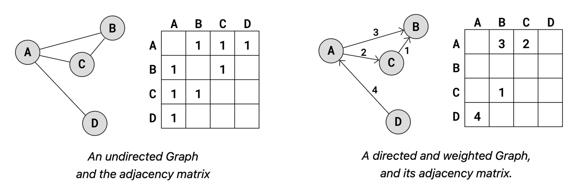
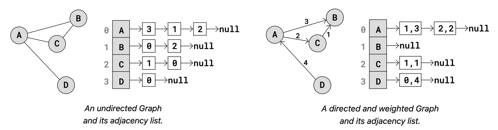
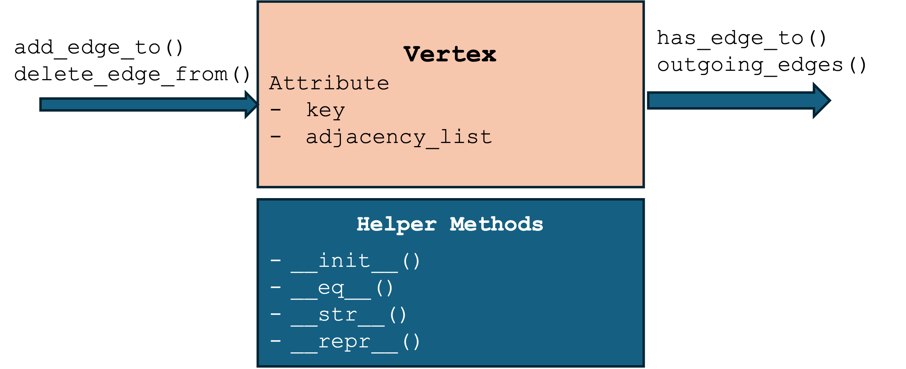
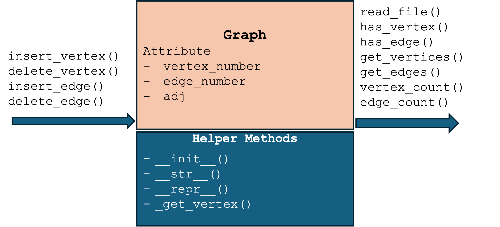
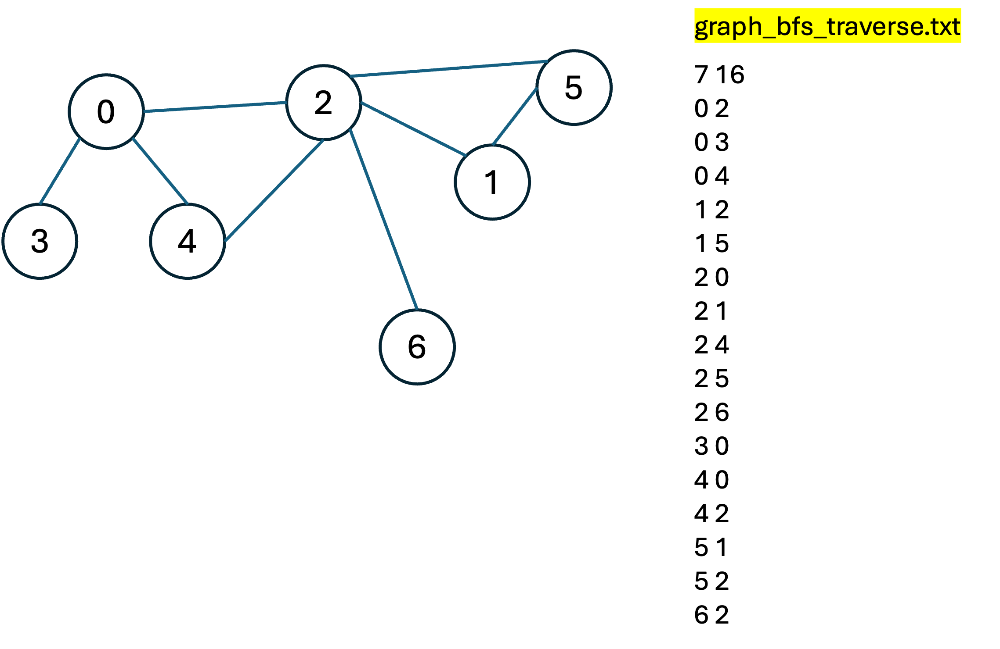
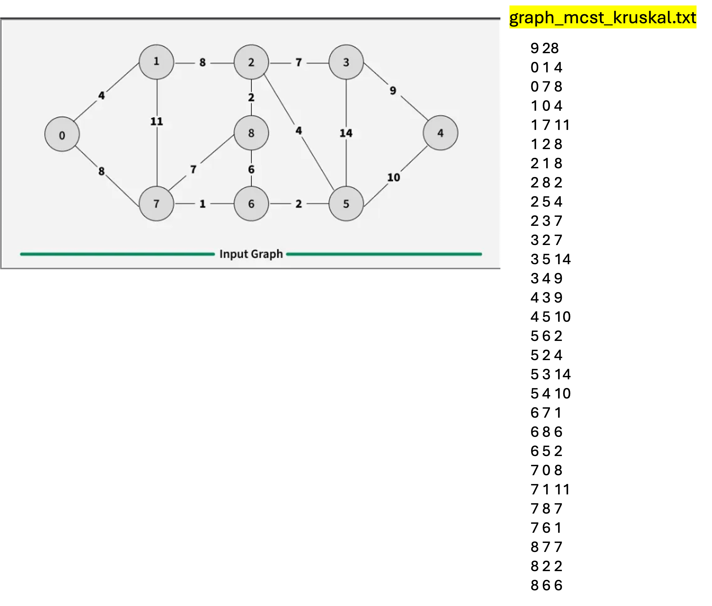

# Graphs
- A Graph is a non-linear data structure that consists of vertices (nodes) and edges.It is a powerful tool for modeling complex networks like social media connections, transportation routes, or web page links.
- A graph $G$ is formally defined as a pair $(V, E)$, where:
  - Vertices ($V$)(or nodes) represent entities or data points.
  - Edges ($E$) represent the relationships or connections between these entities.

    

# Key Terminology
- Adjacency: Two nodes are "adjacent" if there is an edge connecting them directly.
- Degree: The total number of edges connected to a specific vertex.
- Path: A sequence of edges that allows you to travel from one node to another.
- Cycle: A path that starts and ends at the same vertex.
- Loop (self-loop): An edge that begins and ends on the same vertex.

# Types of Graphs
- Undirected: Edges have no direction; the relationship is mutual (eg, friendship).
- Directed: Edges have arrows indicating a one-way relationship (eg, following on X).
- Weighted: Each edge has a numerical value or "cost" (eg, distance between cities).
- Unweighted: All edges are considered equal; there are no values assigned to the links.
- Connected: There is a path between every pair of vertices in the graph.
- Complete: Every pair of distinct vertices is connected by a unique edge.
- Directed cyclic: follow a path along the directed edges that goes in circles.
- Undirected cyclic: come back to the same starting vertex without using the same edge more than once.
- Acyclic: Does not contain any cycles.

[W3 School: Graph properties](https://www.w3schools.com/dsa/dsa_theory_graphs.php)

# Graph Representation
- **Adjacency Matrix**: A 2D array (table) where a $1$ or a weight indicates a connection between row $i$ and column $j$, and a $0$ indicates no connection.
- **Adjacency List**: An array of lists, where each index represents a node and contains a list of all other nodes it is connected to. This is generally more memory-efficient for "sparse" graphs (those with few edges).

    
    

# Real-World Applications
- Social Networks: Suggesting friends based on mutual connections.
- Google Maps: Finding the shortest path between two locations.
- Recommendation Engines: Linking products to users based on purchase history.
- Web Crawling: Following links from one page to another to index the internet.

# Design Graph Vertex

[code/ch10_graph_vertex.py](code/ch10_graph_vertex.py)

# ADT - Graph

[code/ch10_graph.py](code/ch10_graph.py)

# Graph Applications
- Graph traversal: BFS(breadth-first search) and DFS(depth-first search)
- Minimum cost spanning tree (MCST): Kruskal's algorithms
- Shortest Path: Dijkstra's algorithms

# Graph Traversal Algorithms - BFS
> BFS explores the neighbor nodes first, before moving to the next level neighbors, essentially exploring the graph "layer by layer."
- Data structure: use a Queue to manage the discovery order
- Visitation tracking: use a Visited Set (or array) to keep track of nodes already processed, preventing infinite loops in graphs with cycles.
- The Process:
  - Push the starting node into the queue and mark it as visited.
  - While the queue is not empty:
    - Dequeue a node from the front.
    - Check all its unvisited neighbors.
    - Mark each neighbor as visited and enqueue them.

# BFS Illustration
[BFS illustration](https://www.geeksforgeeks.org/dsa/breadth-first-search-or-bfs-for-a-graph)
[ch10_graph_bfs.py](code/ch10_graph_bfs.py)

# Graph Traversal Algorithms - DFS
> DFS explores as far as possible along each branch before backtracking. 
- Data structure: uses a stack (can be implemented using recursion).
- Visitation tracking: use a Visited Set (or array) to keep track of nodes already processed preventing infinite loops in graphs with cycles.
- The Process:
  - Start at a node and mark it as visited.
  - Look at all unvisited neighbors of the current node.
  - Pick one neighbor and immediately jump into it (recursive call) to explore its branch.
  - If a node has no more unvisited neighbors, backtrack to the previous node and continue.

# DFS Illustration
[DFS illustration](https://www.geeksforgeeks.org/dsa/depth-first-search-or-dfs-for-a-graph/)
[ch10_graph_dfs.py](code/ch10_graph_dfs.py)

# Minimum Cost Spanning Tree (MCST)
> MCST is a subset of edges in a connected, weighted graph that connects all vertices together without any cycles and with the minimum possible total edge weight.
- Kruskal's Algorithm is a "Greedy" approach to finding this tree.
  - Sort edges: sort all edges in the graph by their weight in ascending order.
  - Pick edges: iterate through the sorted list and pick the edge with the smallest weight.
  - Cycle detection: if adding the edge connects two vertices that are in different sets, add it to the MST and merge the sets. If the vertices are already in the same set, discard the edge (as it would form a cycle).
  - Termination: stop when there are \(V-1\) edges in the MST (where \(V\) is the number of vertices). 

# Kruskal's Algorithm Illustration
[Kruskal's algorithm illustration](https://www.geeksforgeeks.org/dsa/kruskals-minimum-spanning-tree-algorithm-greedy-algo-2/)
[ch10_graph_kruskal.py](code/ch10_graph_kruskal.py)
  