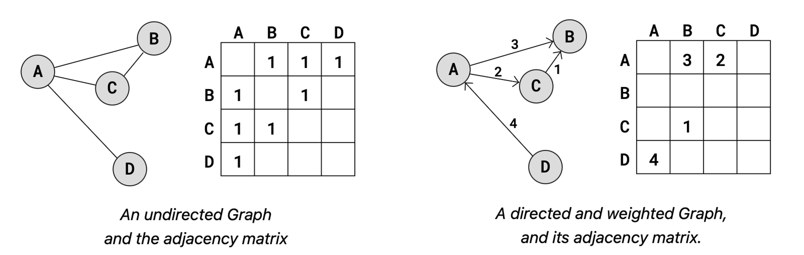
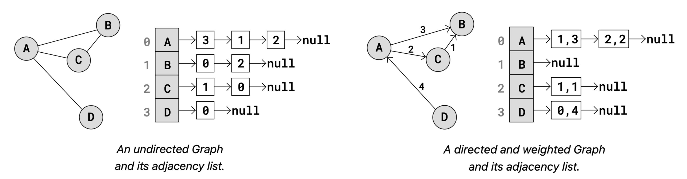
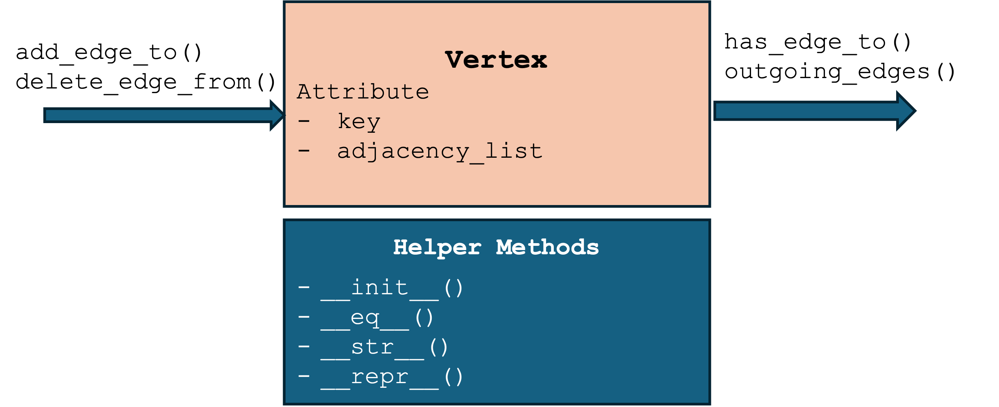
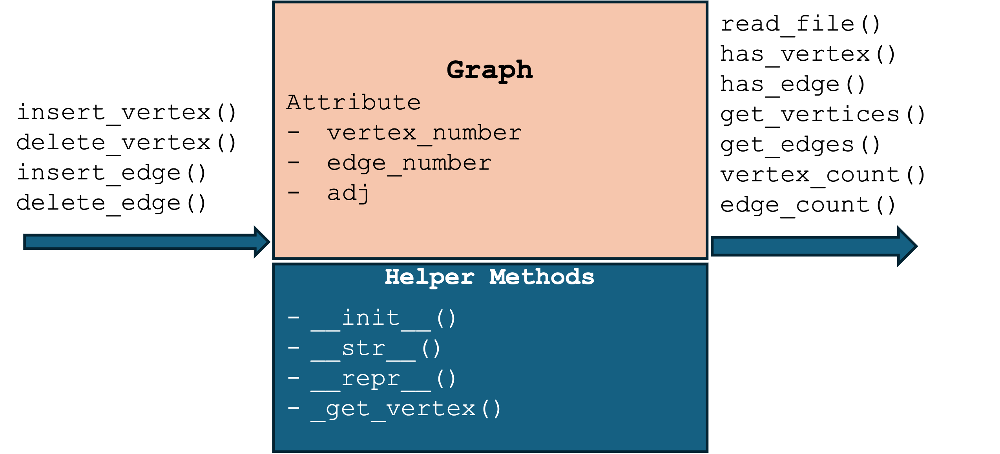
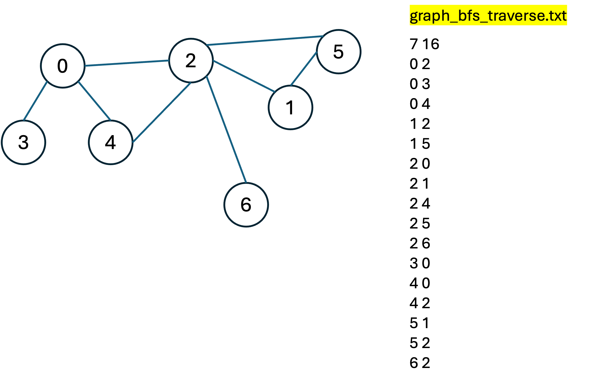
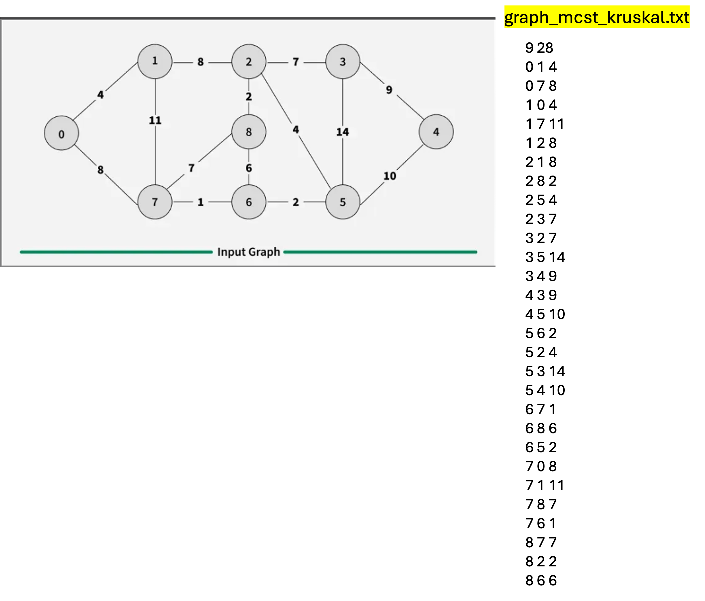

# Graphs
- A Graph is a non-linear data structure that consists of vertices (nodes) and edges.It is a powerful tool for modeling complex networks like social media connections, transportation routes, or web page links.
- A graph $G$ is formally defined as a pair $(V, E)$, where:
  - Vertices ($V$)(or nodes) represent entities or data points.
  - Edges ($E$) represent the relationships or connections between these entities.
<div class="middle-grid">
    
</div>

# Key Terminology
- Adjacency: Two nodes are "adjacent" if there is an edge connecting them directly.
- Degree: The total number of edges connected to a specific vertex.
- Path: A sequence of edges that allows you to travel from one node to another.
- Cycle: A path that starts and ends at the same vertex.
- Loop (self-loop): An edge that begins and ends on the same vertex.

# Types of Graphs
- Undirected: Edges have no direction; the relationship is mutual (eg, friendship).
- Directed: Edges have arrows indicating a one-way relationship (eg, following on X).
- Weighted: Each edge has a numerical value or "cost" (eg, distance between cities).
- Unweighted: All edges are considered equal; there are no values assigned to the links.
- Connected: There is a path between every pair of vertices in the graph.
- Complete: Every pair of distinct vertices is connected by a unique edge.
- Directed cyclic: follow a path along the directed edges that goes in circles.
- Undirected cyclic: come back to the same starting vertex without using the same edge more than once.
- Acyclic: Does not contain any cycles.

[GeeksforGeeks: Graph properties](https://www.geeksforgeeks.org/dsa/graph-data-structure-and-algorithms/)

# Graph Representation
- **Adjacency Matrix**: A 2D array (table) where a $1$ or a weight indicates a connection between row $i$ and column $j$, and a $0$ indicates no connection.
- **Adjacency List**: An array of lists, where each index represents a node and contains a list of all other nodes it is connected to. This is generally more memory-efficient for "sparse" graphs (those with few edges).
<div class="columns">
    
    
</div>

# Real-World Applications
- Social Networks: Suggesting friends based on mutual connections.
- Google Maps: Finding the shortest path between two locations.
- Recommendation Engines: Linking products to users based on purchase history.
- Web Crawling: Following links from one page to another to index the internet.

# Design Graph Vertex

[code/ch11_graph_vertex.py](code/ch11_graph_vertex.py)

# Lab of Graph Vertex
```python
class Vertex:
    def __init__(self, key):
        self._key = key
        self._adjacency_list = ??

    def __eq__(self, other):
            return self._key == other._key
    
    def add_edge_to(self, destination_vertex):
        if self.has_edge_to(destination_vertex):
            raise ValueError(f'Edge already exists: {self} -> {destination_vertex}')
        self._adjacency_list.??????(destination_vertex)        
    
    def has_edge_to(self, destination_vertex):
        return (destination_vertex ?? self._adjacency_list)      
    
    def delete_edge_from(self, destination_vertex):
        if not self.has_edge_to(destination_vertex):
            raise ValueError(f'Edge does not exist: {self} -> {destination_vertex}')
        self._adjacency_list.??????(destination_vertex)

    def outgoing_edges(self):
        return [(self._key, v._key) for v in self._adjacency_list]  
```

# ADT - Graph

[code/ch11_graph.py](code/ch11_graph.py)

# Lab of Graph
```python
def __init__(self):
    self._vertex_number = 0
    self._edge_number = 0
    self._adj = ??  # key: vertex key, value: vertex object {2: Vertex(2), 3: Vertex(3), ...}

def insert_vertex(self, key):
    """Add a vertex to the graph with the given key."""
    if key in self._adj:
        raise ValueError(f"Vertex {key} already exists!")
    self._adj[key] = ??????(key)
    self._vertex_number += 1   

def delete_vertex(self, key):
    """Delete a vertex from the graph. Also removes all edges connected to it."""
    v = self._get_vertex(key)
    for u in self._adj.values():
        if u != v and u.has_edge_to(v):
            u.delete_edge_from(v)
    ??? self._adj[key]
    self._vertex_number -= 1     

def insert_edge(self, key1, key2):
    """Add an edge between two vertices in the graph."""
    v1 = self._get_vertex(key1)
    v2 = self._get_vertex(key2)
    v1.add_edge_to(v2)
    self._edge_number += 1

def delete_edge(self, key1, key2):
    """Delete an edge between two vertices in the graph."""
    v1 = self._get_vertex(key1)
    v2 = self._get_vertex(key2)
    v1.delete_edge_from(v2)
    self._edge_number -= 1
```

# Graph Applications
- Graph traversal: BFS(breadth-first search) and DFS(depth-first search)
- Minimum cost spanning tree (MCST): Kruskal's algorithms
- Shortest path: Dijkstra's algorithms

# Graph Traversal Algorithms - BFS
> BFS explores the neighbor nodes first, before moving to the next level neighbors, essentially exploring the graph "layer by layer."
- Data structure: use a Queue to manage the discovery order
- Visitation tracking: use a Visited Set (or array) to keep track of nodes already processed, preventing infinite loops in graphs with cycles.
- The Process:
  - Push the starting node into the queue and mark it as visited.
  - While the queue is not empty:
    - Dequeue a node from the front.
    - Check all its unvisited neighbors.
    - Mark each neighbor as visited and enqueue them.

# Graph Traversal Algorithms - DFS
> DFS explores as far as possible along each branch before backtracking. 
- Data structure: uses a stack (can be implemented using recursion).
- Visitation tracking: use a Visited Set (or array) to keep track of nodes already processed preventing infinite loops in graphs with cycles.
- The Process:
  - Start at a node and mark it as visited.
  - Look at all unvisited neighbors of the current node.
  - Pick one neighbor and immediately jump into it (recursive call) to explore its branch.
  - If a node has no more unvisited neighbors, backtrack to the previous node and continue.    

# Illustration of Graph BFS and DFS Algorithms
[](https://youtu.be/oLtvUWpAnTQ?si=BdpymJoCxagULYy2) 

# Implement Graph BFS Algorithm
[ch11_graph_bfs.py](code/ch11_graph_bfs.py)


# Implement Graph DFS Algorithm
[ch11_graph_dfs.py](code/ch11_graph_dfs.py)


# Lab of Graph BFS and DFS
[](https://youtu.be/bD8RT0ub--0?si=KCJYRHDYnxRh_epA) 

[code/ch11_graph_bfs_simple.py](code/ch11_graph_bfs_simple.py)
[code/ch11_graph_dfs_simple.py](code/ch11_graph_dfs_simple.py)

# Minimum Cost Spanning Tree (MCST)
> A Minimal Cost Spanning Tree (MCST)or Minimum Spanning Tree (MST), is a subset of the edges of a connected, weighted, undirected graph that connects all vertices together, without any cycles and with the minimum possible total edge weight.
- Spanning tree: A subgraph that includes all vertices of the original graph and is a tree (connected and acyclic).
- Minimal cost: Among all possible spanning trees, sum of weights of edges is smallest.
- Number of edges: a graph has 𝑉 vertices, its MCST have exactly 𝑉 − 1 edges.
- Non-uniqueness: If multiple edges have the same weight, there may be more than one valid MST for the graph.
- Two primary methods for finding an MCST: Kruskal's algorithm, Prim's algorithm

# Illustration of MCST
[](https://youtu.be/KsobpcI3dN0?si=taxLfNyivd9AwrgK) 

# Kruskal's Algorithm is a "Greedy" approach to finding MCST
  - Sort edges: sort all edges in the graph by their weight in ascending order.
  - Pick edges: iterate through the sorted list and pick the edge with the smallest weight.
  - Cycle detection: if adding the edge connects two vertices that are in different sets, add it to the MST and merge the sets. If the vertices are already in the same set, discard the edge (as it would form a cycle).
  - Termination: stop when there are \(V-1\) edges in the MST (where \(V\) is the number of vertices). 

# Illustration of Kruskal's Algorithm
[](https://youtu.be/drSPZL6A0RI?si=khKtpqyrMAJEyJRc)

# Implement Kruskal's Algorithm

[ch11_graph_kruskal.py](code/ch11_graph_kruskal.py)
  

# Shortest Path: Dijkstra's Algorithm
- Dijkstra's Algorithm is a classic graph algorithm used to find the shortest path from a single source node to all other nodes in a graph. Proposed by Dutch computer scientist Edsger W. Dijkstra in 1956, it is widely used in network routing protocols (like OSPF) and map navigation systems (like Google Maps).
- Dijkstra's is essentially a Greedy Algorithm. Its fundamental principle is: at each step, select the unvisited node with the "shortest" current distance from the source, and use it as a bridge to update the distances to its neighboring nodes.
- Dijkstra’s does not work with negative edge weights. If a graph contains negative weights, the Bellman-Ford algorithm is typically used instead.

# Steps of Dijkstra's Algorithm
1. Initialization: Set the distance to the source node to 0 and all other nodes to ∞. Mark all nodes as "unvisited."
2. Selection: From the set of unvisited nodes, pick the one with the shortest distance to the source as the "current node."
3. Relaxation: Examine all neighbors of the current node. Calculate: (distance to current node) + (edge weight to neighbor). If this value is smaller than the neighbor's previously recorded distance, update it.
4. Mark as Visited: Once neighbors are checked, mark the current node as "visited." It will not be processed again.
5. Repeat: Repeat steps 2 through 4 until all nodes are visited or the shortest path to a specific target is found.

# Illustration of Dijkstra's Algorithm
[](https://youtu.be/JLARzu7coEs?si=Gwncu1OsUnjtECeb)

# Implement Dijkstra's Algorithm
[ch11_graph_dijkstra.py](code/ch11_graph_dijkstra.py)

# Recap
- Graphs are data structures that model relationships between entities.
- Key graph types include undirected, directed, weighted, and unweighted.
- Graph traversal algorithms like BFS and DFS explore nodes in different orders.
- Minimum Cost Spanning Tree (MCST) can be found using Kruskal's algorithm.
- Dijkstra's algorithm efficiently finds the shortest path from a source node to all other nodes in a graph with non-negative edge weights.

