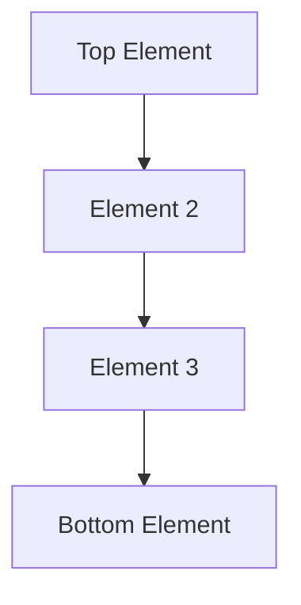

# [CS101] Data Structures & Algorithms
## Week [XX]: [Topic Name, e.g., Stacks & Queues]

> **Instructor:** [Your Name]
> **Date:** 2026-XX-XX
> **Duration:** 3 Hours
> **Goal:** Understand the logical structure, Python implementation, and practical use cases of [Topic].

---

## 1. Learning Objectives
By the end of this lecture, you will be able to:
* [Objective 1]
* [Objective 2]
* [Objective 3]

---

## 2. Concept: The "Mental Model"
**Analogy:**
> *[Insert analogy here, e.g., "Think of a Stack like a stack of cafeteria trays..."]*

**Key Characteristics:**
* **Property 1:** [e.g., LIFO - Last In, First Out]
* **Property 2:** [e.g., Restricted access - can only touch the top]

---

## 3. Visual Representation
### Diagram
